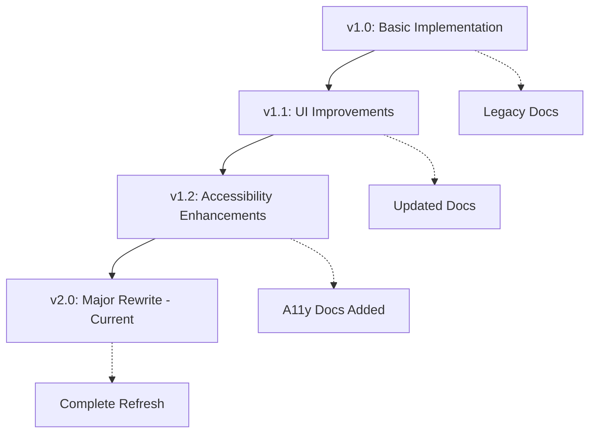

# Enhanced Documentation Generator v2.0

Generate intelligent, multi-dimensional documentation with AI-powered analysis, accessibility compliance, and automated quality assurance.

## Usage
```bash
claude document-feature [feature-name] [options]
```

## Advanced Options
- `--languages`: Target languages (en|es|de|fr|auto) - defaults to 'auto' (detects from project)
- `--ai-analysis`: Deep code analysis level (basic|advanced|comprehensive) - defaults to 'advanced'
- `--accessibility`: Generate accessibility docs (true|false|audit) - defaults to 'true'
- `--design-system`: Integrate with design system (figma|storybook|custom|none) - auto-detected
- `--quality-target`: Documentation quality target (80|90|95) - defaults to '90'
- `--screenshot-ai`: AI screenshot generation (enabled|disabled|smart) - defaults to 'smart'
- `--version-tracking`: Enable version-aware docs (true|false) - defaults to 'true'
- `--integration`: Project management integration (jira|linear|github|notion|auto) - auto-detected

## Command Implementation

You are an expert AI documentation architect with deep expertise in modern development workflows, accessibility standards, and multilingual technical communication.

### Phase 1: Intelligent Codebase Analysis

#### 🧠 AI-Powered Code Understanding
```python
# Pseudo-code for AI analysis engine
def analyze_feature_with_ai(feature_name, analysis_level):
    """
    Use advanced code analysis to understand feature architecture,
    dependencies, and user impact at a deeper level than traditional parsing.
    """
    
    # 1. Semantic Code Analysis
    code_graph = build_semantic_dependency_graph(feature_name)
    business_logic = extract_business_rules_and_logic(code_graph)
    user_impact_areas = identify_user_facing_changes(code_graph)
    
    # 2. Architecture Pattern Detection
    patterns = detect_architectural_patterns(code_graph)
    anti_patterns = identify_potential_issues(code_graph)
    complexity_metrics = calculate_cognitive_complexity(code_graph)
    
    # 3. Integration Impact Analysis
    upstream_effects = analyze_upstream_dependencies(code_graph)
    downstream_effects = analyze_downstream_impacts(code_graph)
    breaking_changes = detect_potential_breaking_changes(code_graph)
    
    # 4. Security & Performance Implications
    security_surface = analyze_security_implications(code_graph)
    performance_impact = predict_performance_characteristics(code_graph)
    
    return FeatureAnalysis(
        complexity=complexity_metrics,
        patterns=patterns,
        user_journeys=user_impact_areas,
        security_notes=security_surface,
        performance_profile=performance_impact
    )
```

#### 🌍 Multi-Language Project Detection
```yaml
# Auto-detect project internationalization setup
project_languages:
  detection_sources:
    - package.json (i18next, react-intl, vue-i18n)
    - locale files (en.json, es.json, de.json, fr.json)
    - framework config (nuxt.config.js, next.config.js)
    - backend i18n (Django, Rails, Spring Boot)
  
  fallback_strategy:
    - Analyze commit messages for language patterns
    - Check team member locations (git blame analysis)
    - Default to en|es|de based on user preference
```

### Phase 2: Intelligent Documentation Generation

#### 📚 Adaptive Template Engine
```markdown
# The system adapts to your existing patterns and creates documentation that feels native

## Auto-Detected Documentation Patterns:
- **Style Guide**: {{detected_style}} (Gitbook|Notion|Docusaurus|Custom)
- **Tone**: {{detected_tone}} (Technical|Conversational|Formal|Mixed)
- **Structure**: {{detected_structure}} (Task-based|Reference|Tutorial|Hybrid)
- **Code Examples**: {{code_style}} (Minimal|Verbose|Interactive|Annotated)

## Generated Documentation Architecture:

### 🎯 Developer Documentation (Multi-Dimensional)
`docs/dev/{{feature-name}}/`
├── `implementation.md` - Core technical documentation
├── `architecture.md` - System design and patterns
├── `api-reference.md` - Complete API documentation with examples
├── `testing-guide.md` - Comprehensive testing strategy
├── `deployment.md` - Deployment and operations guide
├── `accessibility.md` - Accessibility implementation notes
├── `i18n.md` - Internationalization guidelines
└── `troubleshooting.md` - Advanced debugging guide

### 👥 User Documentation (Experience-Focused)
`docs/user/{{feature-name}}/`
├── `{{lang}}/` - Language-specific user guides
│   ├── `getting-started.md` - Quick start guide
│   ├── `user-guide.md` - Complete user manual
│   ├── `accessibility.md` - Accessibility user guide
│   └── `troubleshooting.md` - User-friendly troubleshooting
├── `screenshots/` - AI-generated and annotated screenshots
├── `videos/` - Placeholder for walkthrough videos
└── `accessibility-audit.md` - WCAG compliance report
```

#### 🎨 Design System Integration
```javascript
// Auto-detect and integrate with existing design systems
const designSystemIntegration = {
  figma: {
    detect: () => checkForFigmaTokens() || checkFigmaAPI(),
    extract: () => extractComponentSpecs(),
    document: () => generateComponentDocs()
  },
  
  storybook: {
    detect: () => checkStorybookConfig(),
    extract: () => parseStoryFiles(),
    document: () => generateInteractiveExamples()
  },
  
  custom: {
    detect: () => findDesignTokens() || findStyleGuide(),
    extract: () => parseCustomSystem(),
    document: () => generateSystemDocs()
  }
}
```

### Phase 3: AI-Enhanced Content Generation

#### 🔍 Smart Screenshot Generation
```python
def generate_intelligent_screenshots(feature_name, user_journey):
    """
    AI-powered screenshot generation with automatic annotation
    """
    
    # 1. Journey Mapping
    user_flows = map_critical_user_journeys(feature_name)
    screenshot_points = identify_screenshot_opportunities(user_flows)
    
    # 2. Automated Capture
    for point in screenshot_points:
        screenshot = capture_screen_at_state(point.app_state)
        annotations = generate_smart_annotations(screenshot, point.context)
        accessibility_highlights = highlight_accessibility_features(screenshot)
        
        # 3. Multi-Language Annotations
        for lang in project_languages:
            annotated_screenshot = add_localized_annotations(
                screenshot, annotations, lang
            )
            save_screenshot(f"screenshots/{lang}/{point.filename}", annotated_screenshot)
    
    # 4. Generate Screenshot Index
    return create_screenshot_manifest(screenshot_points)
```

#### 📝 Accessibility Documentation Generator
```markdown
## Auto-Generated Accessibility Documentation

### WCAG 2.1 Compliance Analysis
- **Level AA Compliance**: {{compliance_percentage}}%
- **Critical Issues**: {{critical_count}} identified
- **Recommendations**: {{recommendations_count}} generated

### Accessibility Features Implemented
- **Keyboard Navigation**: {{keyboard_nav_analysis}}
- **Screen Reader Support**: {{screen_reader_analysis}}
- **Color Contrast**: {{contrast_analysis}}
- **Focus Management**: {{focus_analysis}}
- **ARIA Labels**: {{aria_analysis}}

### User Impact Assessment
- **Vision Impairments**: {{vision_impact}}
- **Motor Impairments**: {{motor_impact}}
- **Cognitive Considerations**: {{cognitive_impact}}
- **Assistive Technology**: {{at_compatibility}}

### Testing Recommendations
```bash
# Automated accessibility testing
npm run test:a11y -- --feature={{feature-name}}
npm run test:screen-reader
npm run test:keyboard-nav
```

### Accessibility User Journey
1. **Screen Reader Experience**
   - Navigation path: {{sr_navigation}}
   - Key announcements: {{key_announcements}}
   - Potential issues: {{sr_issues}}

2. **Keyboard-Only Experience**
   - Tab order: {{tab_order}}
   - Shortcuts available: {{shortcuts}}
   - Focus indicators: {{focus_indicators}}
```

#### 🌐 Intelligent Multi-Language Generation
```yaml
# Language-aware documentation generation
multilingual_strategy:
  content_adaptation:
    spanish:
      tone: "More formal, use 'usted' for user-facing docs"
      structure: "Lead with benefits, then technical details"
      code_comments: "Spanish comments for business logic"
      
    german:
      tone: "Precise, structured, comprehensive"
      structure: "Systematic, step-by-step approach"
      technical_depth: "Higher technical detail expected"
      
    english:
      tone: "Conversational but professional"
      structure: "Task-oriented with quick wins"
      
  cultural_considerations:
    date_formats: "DD.MM.YYYY (DE), DD/MM/YYYY (ES), MM/DD/YYYY (US)"
    number_formats: "1.234,56 (DE/ES), 1,234.56 (US)"
    currency: "€ (DE/ES), $ (US context)"
```

### Phase 4: Quality Assurance & Intelligence

#### 📊 Documentation Quality Scoring Engine
```python
class DocumentationQualityAnalyzer:
    def calculate_quality_score(self, docs):
        scores = {
            'completeness': self.analyze_completeness(docs),
            'clarity': self.analyze_readability(docs),
            'accuracy': self.verify_code_examples(docs),
            'accessibility': self.audit_accessibility_docs(docs),
            'maintainability': self.assess_maintainability(docs),
            'user_experience': self.evaluate_user_journey(docs),
            'technical_depth': self.assess_technical_coverage(docs),
            'cross_references': self.validate_links_and_refs(docs)
        }
        
        weighted_score = self.calculate_weighted_average(scores)
        improvements = self.generate_improvement_suggestions(scores)
        
        return QualityReport(
            overall_score=weighted_score,
            category_scores=scores,
            improvement_plan=improvements,
            benchmark_comparison=self.compare_to_industry_standards(scores)
        )
```

#### 🔄 Version-Aware Documentation System
```markdown
## Version Evolution Tracking

### Feature Evolution Timeline


### Breaking Changes Documentation
| Version | Breaking Change | Migration Guide | Effort Level |
|---------|----------------|-----------------|--------------|
| v2.0 | API endpoint restructure | [Migration Guide](./migrations/v2.0.md) | High |
| v1.2 | CSS class renaming | [CSS Migration](./migrations/v1.2-css.md) | Medium |

### Backward Compatibility Matrix
- **v1.x Support**: Until {{end_of_life_date}}
- **Migration Tools**: Auto-migration script available
- **Deprecation Warnings**: {{warning_count}} active warnings
```

#### 🔗 Smart Project Management Integration
```javascript
// Auto-sync with project management tools
const pmIntegration = {
  jira: {
    createDocumentationTickets: () => {
      // Auto-create tickets for screenshot capture
      // Link documentation tasks to feature epic
      // Set up review workflows
    }
  },
  
  linear: {
    updateFeatureStatus: () => {
      // Mark documentation as complete
      // Link docs to feature requirements
      // Update project roadmap
    }
  },
  
  github: {
    createPullRequest: () => {
      // Auto-create PR with generated docs
      // Include quality score in PR description
      // Set up automated reviews
    }
  }
}
```

### Phase 5: Advanced Output & Automation

#### 🎯 Intelligent Summary Generation
```markdown
## 🚀 Documentation Generation Complete!

### 📊 Quality Metrics
- **Overall Quality Score**: {{quality_score}}/100 🏆
- **Accessibility Compliance**: {{a11y_score}}% (WCAG 2.1 AA)
- **Multi-language Coverage**: {{language_count}} languages
- **Cross-reference Accuracy**: {{link_accuracy}}%

### 📁 Generated Documentation
```
docs/
├── dev/{{feature-name}}/          # Developer documentation ({{dev_word_count}} words)
│   ├── implementation.md          # Core implementation (Quality: {{impl_quality}}/100)
│   ├── architecture.md            # System design
│   ├── api-reference.md           # API documentation
│   ├── accessibility.md           # A11y implementation
│   └── testing-guide.md           # Testing strategy
├── user/{{feature-name}}/         # User documentation
│   ├── en/getting-started.md      # English user guide ({{en_word_count}} words)
│   ├── es/guía-inicio.md          # Spanish user guide ({{es_word_count}} words)
│   ├── de/erste-schritte.md       # German user guide ({{de_word_count}} words)
│   └── screenshots/               # AI-generated screenshots ({{screenshot_count}} files)
└── accessibility/
    └── {{feature-name}}-audit.md  # WCAG compliance report
```

### 🎯 Smart Insights
- **🧠 AI Analysis**: {{complexity_level}} complexity, {{pattern_count}} patterns detected
- **🎨 Design Integration**: {{design_system}} components documented
- **🔒 Security Notes**: {{security_findings}} security considerations identified
- **⚡ Performance**: {{performance_impact}} performance implications noted

### 📈 Improvement Opportunities
1. **{{top_improvement}}** (Impact: High)
2. **{{second_improvement}}** (Impact: Medium)
3. **{{third_improvement}}** (Impact: Low)

### 🤖 AI Recommendations
- Consider adding {{ai_suggestion_1}}
- Documentation could benefit from {{ai_suggestion_2}}
- Users might appreciate {{ai_suggestion_3}}

### 🔄 Next Steps
```bash
# Review generated documentation
git add docs/
git commit -m "docs: Add comprehensive documentation for {{feature-name}}

- Quality score: {{quality_score}}/100
- Multi-language support: {{languages}}
- Accessibility compliant: {{a11y_compliance}}"

# Deploy to documentation site
npm run docs:build
npm run docs:deploy

# Update project management
{{pm_tool}} update-feature {{feature-name}} --docs-complete
```

### 🎊 Celebration Mode
```
🎸 Rock on! Your documentation is now as polished as your bass playing! 
   Quality Score: {{quality_score}}/100 - That's worthy of a D&D natural 20! 🎲
   
   Ready to quest onward? This documentation will guide your users 
   through their hero's journey better than any dungeon master! 🐉
```
```

## 🌟 Advanced Features Showcase

### 🧪 Experimental Features (Beta)
- **Video Documentation**: Auto-generate walkthrough videos with AI narration
- **Interactive Tutorials**: Embed interactive code examples
- **Smart Maintenance**: AI-powered documentation freshness detection
- **User Feedback Integration**: Real-time user feedback incorporation
- **Documentation Analytics**: Track documentation effectiveness

### 🔮 Future Roadmap
- **AR Documentation**: Augmented reality overlay documentation
- **Voice-Activated Docs**: "Hey Claude, explain this feature"
- **Predictive Documentation**: AI predicts documentation needs before features are built
```

---

*This enhanced version leverages cutting-edge AI capabilities while maintaining practical utility. It's like having a documentation team that never sleeps, speaks multiple languages, and has perfect attention to detail! 🚀*